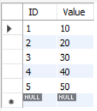
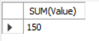
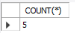
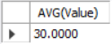

# Ex-07-Aggregate-function-in-SQL
## AIM:-
To write a sql query to perform Aggregate function in SQL.

## PROCEDURE:-
### STEP 1:
create database AGGREGATE_FUNCTION.

### STEP 2:
create table DETAILS with ID and value.

### STEP 3:
Insert Value to the table DETAILS.

### STEP 4:
Perform Aggregate functions like SUM(),COUNT(),AVG().

## PROGRAM:-
```sql
CREATE DATABASE AGGREGATE_FUNCTION;
USE AGGREGATE_FUNCTION;
CREATE TABLE DETAILS (
  ID INT PRIMARY KEY,
  Value INT
);
INSERT INTO DETAILS (ID, Value) VALUES
(1, 10),
(2, 20),
(3, 30),
(4, 40),
(5, 50);
SELECT * FROM DETAILS;
SELECT SUM(Value) FROM DETAILS;
SELECT COUNT(*) FROM DETAILS;
SELECT AVG(Value) FROM DETAILS;
```
## OUTPUT:-







## RESULT:-
A sql query to perform Aggregate function in SQL has been executed.